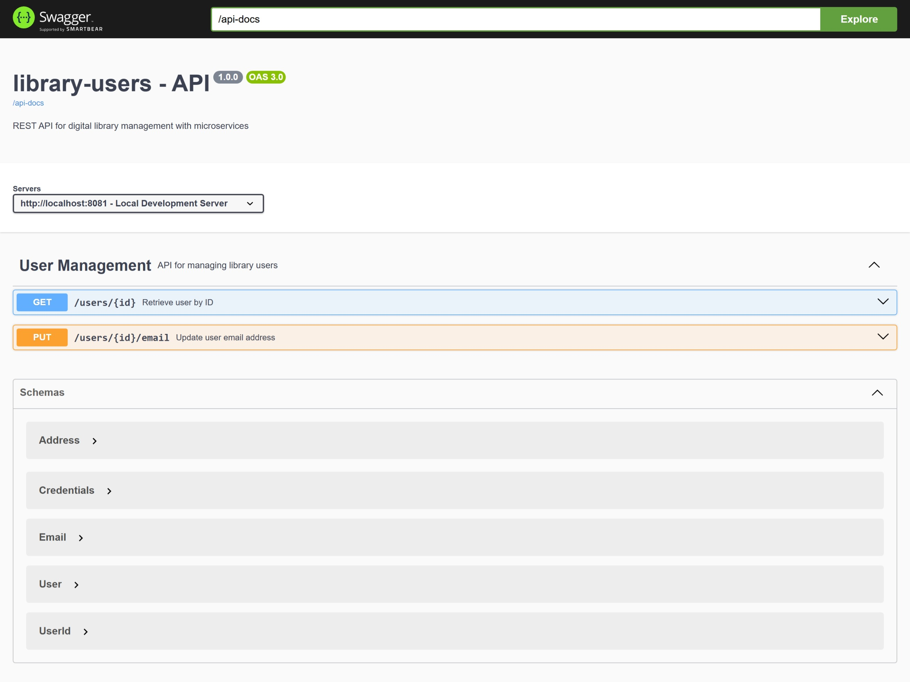
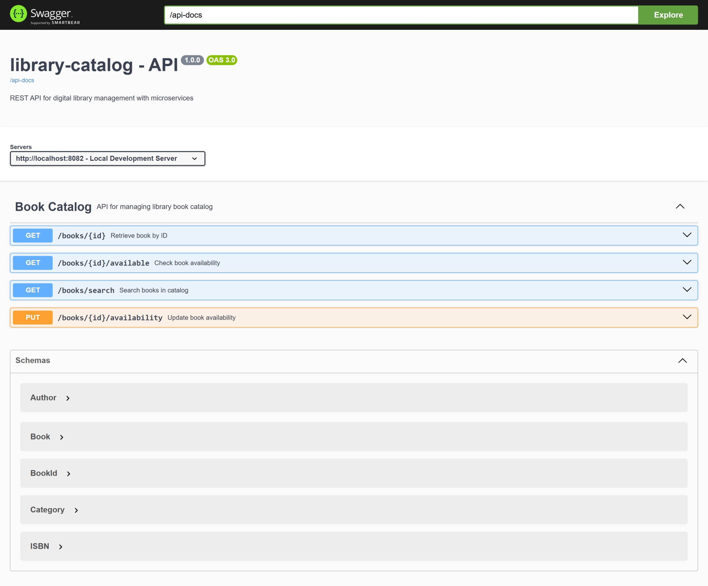
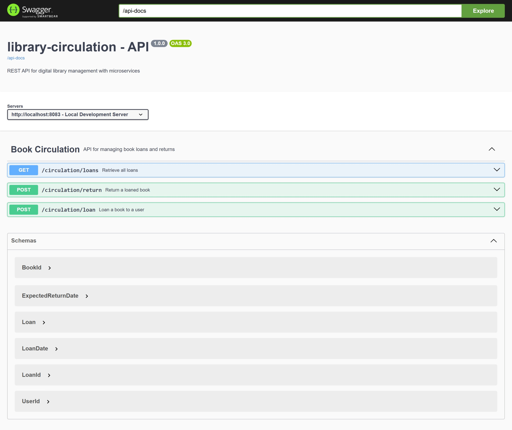
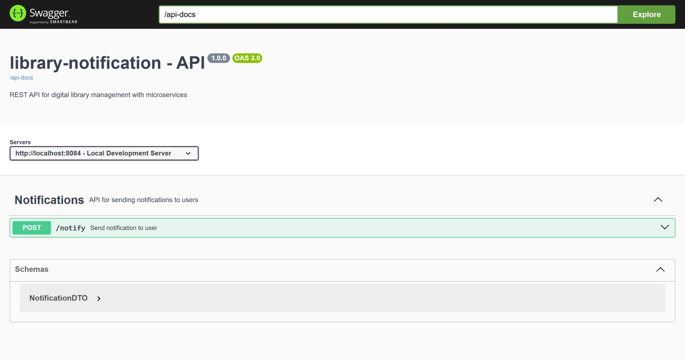

# Sistema de Microservicios para Biblioteca 📚

## Descripción General

Sistema de gestión bibliotecaria construido con arquitectura de microservicios usando Spring Boot. El sistema permite gestionar usuarios, catálogo de libros, préstamos y notificaciones de manera distribuida y escalable.

## Arquitectura de Microservicios

### 🏗️ Microservicio Core (Configuraciones Compartidas)

- **Descripción**: Librería con configuraciones comunes (Seguridad, OpenAPI, Keycloak)
- **Puerto**: N/A (Librería)
- **Función**: Proporciona configuraciones automáticas para todos los servicios

### 👥 Microservicio de Usuarios

- **Descripción**: Gestión de usuarios de la biblioteca
- **Puerto**: 8081
- **Endpoints Principales**:
  - `GET /users/{id}` - Obtener usuario por ID
  - `PUT /users/{id}/email` - Actualizar email del usuario

### 📖 Microservicio de Catálogo

- **Descripción**: Gestión del inventario de libros
- **Puerto**: 8082
- **Endpoints Principales**:
  - `GET /books/{id}` - Obtener libro por ID
  - `GET /books/{id}/available` - Verificar disponibilidad
  - `PUT /books/{id}/availability` - Actualizar disponibilidad
  - `GET /books/search` - Buscar libros

### 🔄 Microservicio de Circulación

- **Descripción**: Gestión de préstamos y devoluciones
- **Puerto**: 8083
- **Endpoints Principales**:
  - `POST /circulation/loan` - Prestar libro
  - `POST /circulation/return` - Devolver libro
  - `GET /circulation/loans` - Obtener préstamos

### 📧 Microservicio de Notificaciones

- **Descripción**: Envío de notificaciones a usuarios
- **Puerto**: 8084
- **Endpoints Principales**:
  - `POST /notify` - Enviar notificación

## Documentación Swagger - Funcionamiento Correcto

### Microservicio de Usuarios (Puerto 8081)



### Microservicio de Catálogo (Puerto 8082)



### Microservicio de Circulación (Puerto 8083)



### Microservicio de Notificaciones (Puerto 8084)



## Tecnologías Utilizadas

### Backend

- **Spring Boot 3.x** - Framework principal
- **Spring Security** - Seguridad y autenticación
- **Spring Data JPA** - Persistencia de datos
- **OpenFeign** - Comunicación entre microservicios
- **H2 Database** - Base de datos en memoria (desarrollo)

### Seguridad y Autenticación

- **Keycloak** - Servidor de autenticación (Puerto 8090)
- **OAuth2/JWT** - Protocolo de autenticación
- **Roles**: LIBRARIAN, USER

### Documentación

- **Swagger/OpenAPI 3** - Documentación interactiva de APIs
- **SpringDoc** - Integración Spring Boot con OpenAPI

### Containerización

- **Docker** - Contenedores para cada microservicio
- **Docker Compose** - Orquestación de servicios

## Requisitos del Sistema

- Java 17+
- Maven 3.8+
- Docker y Docker Compose
- Keycloak Server (Puerto 8090)

## Instrucciones de Ejecución

### 1. Ejecutar con Docker Compose

```bash
docker-compose up -d
```

### 2. Ejecutar Manualmente

```bash
# 1. Iniciar Keycloak (Puerto 8090)
# 2. Compilar el proyecto parent
cd parent && mvn clean install

# 3. Compilar e instalar library-core
cd microservicio-core && mvn clean install

# 4. Ejecutar cada microservicio
cd microservicio-usuarios && mvn spring-boot:run
cd microservicio-catalogo && mvn spring-boot:run
cd microservicio-circulacion && mvn spring-boot:run
cd microservicio-notificacion && mvn spring-boot:run
```

## URLs de Acceso

### Servicios

- **Usuarios**: http://localhost:8081
- **Catálogo**: http://localhost:8082
- **Circulación**: http://localhost:8083
- **Notificaciones**: http://localhost:8084
- **Keycloak**: http://localhost:8090

### Documentación Swagger

- **Usuarios**: http://localhost:8081/swagger-ui.html
- **Catálogo**: http://localhost:8082/swagger-ui.html
- **Circulación**: http://localhost:8083/swagger-ui.html
- **Notificaciones**: http://localhost:8084/swagger-ui.html

### Consolas H2 (Desarrollo)

- **Usuarios**: http://localhost:8081/h2-console
- **Catálogo**: http://localhost:8082/h2-console
- **Circulación**: http://localhost:8083/h2-console
- **Notificaciones**: http://localhost:8084/h2-console

## Configuración de Keycloak

El sistema utiliza el realm `library` con los siguientes roles:

- **ROLE_LIBRARIAN**: Acceso completo
- **ROLE_USER**: Acceso de solo lectura

Archivo de configuración: `realm-export.json`

## Flujo de Funcionamiento

1. **Autenticación**: Los usuarios se autentican via Keycloak
2. **Catálogo**: Los usuarios consultan libros disponibles
3. **Préstamos**: Los bibliotecarios procesan préstamos de libros
4. **Notificaciones**: El sistema notifica automáticamente sobre préstamos/devoluciones
5. **Devoluciones**: Los bibliotecarios procesan devoluciones

## Integraciones Entre Servicios

- **Circulación → Catálogo**: Verificar/actualizar disponibilidad de libros
- **Circulación → Notificaciones**: Enviar notificaciones de préstamos/devoluciones
- **Todos → Core**: Configuraciones compartidas de seguridad y documentación
